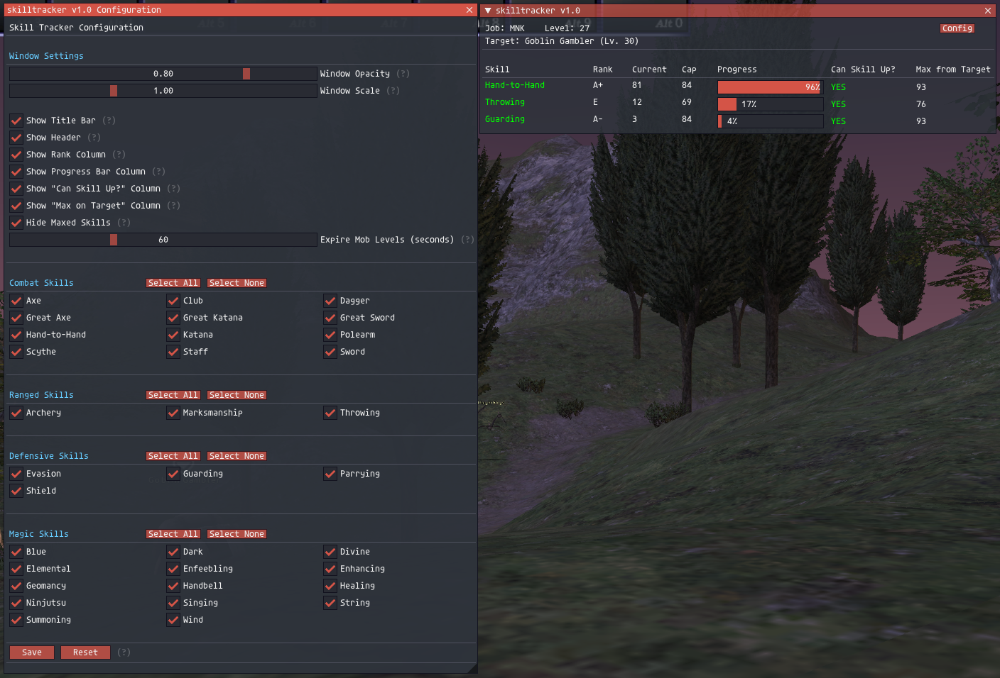

# SkillTracker

A simple Ashita 4 addon that tracks your combat and magic skills against your skill caps.

## Features

- Real-time skill tracking
- Highlights skills in green when you can skill up on your current checked target
- Fully configurable GUI with toggleable columns
- Per-skill visibility controls

## Usage

### Commands

- `/skilltracker` or `/st` - Toggle the main window
- `/skilltracker config` - Open configuration menu
- `/skilltracker help` - Show help

### Skills ups vs target

To see which skills can gain skillups against a certain target:
1. Target a mob
2. Use `/check` on the mob to get its level
3. Skills you can gain skillups on will turn green and show "YES" in the "Can Skill Up?" column

### Configuration

- Open configuration with `/skilltracker config` and set the visibility of skills
